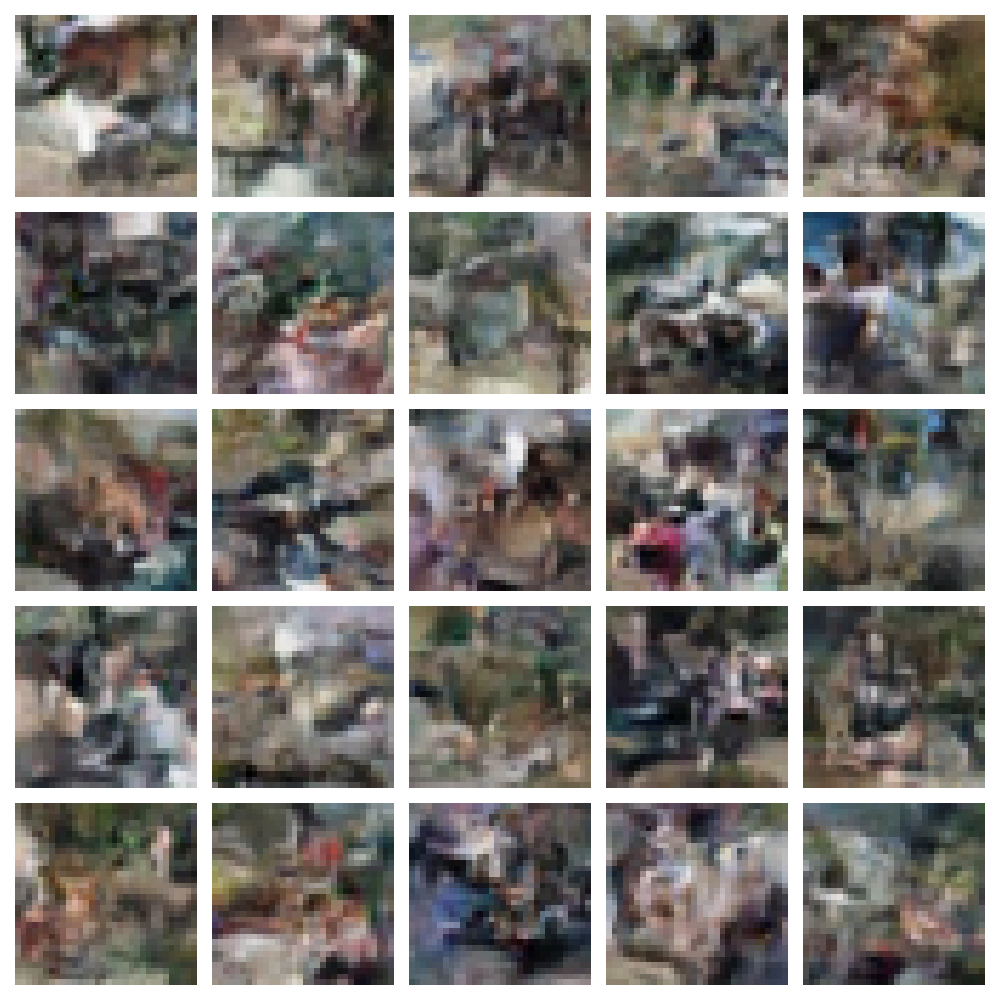
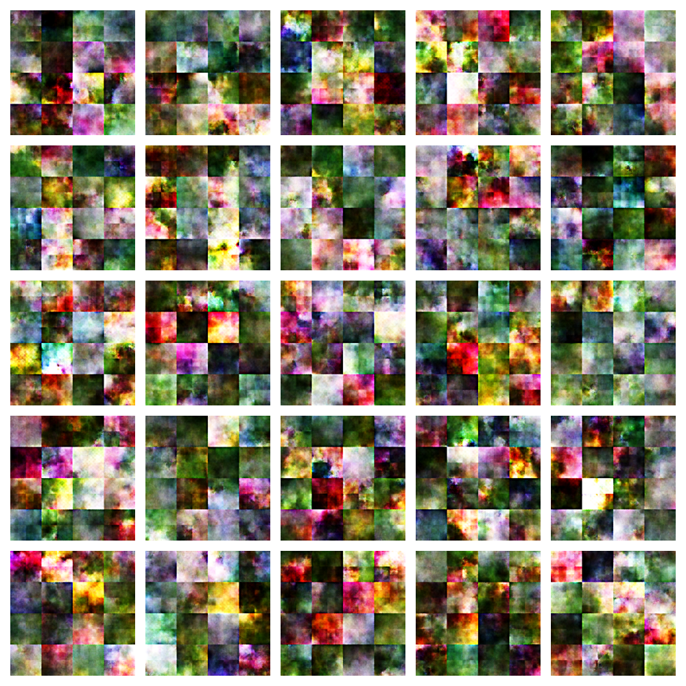
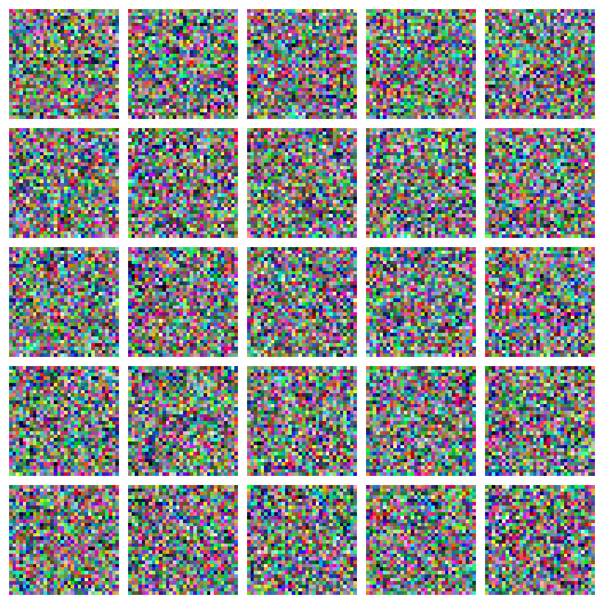
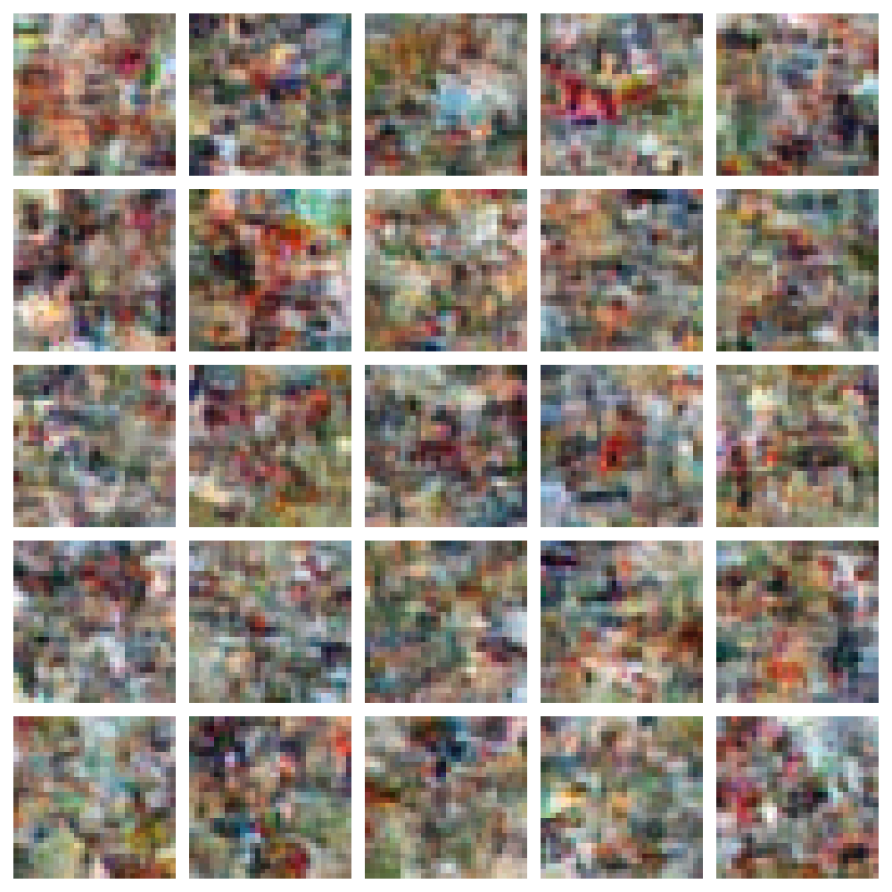

# normalizing-flows-pytorch

Implementation of normalizing flow models: NICE, RealNVP, Glow, cGlow.

| Figure 1 | Figure 2 |
|----------|----------|
|  |  | 
| NICE fit on two Gaussians | RealNVP fit on Moons |
|  |  |
| NICE sample generation for MNIST | RealNVP sample generation for CIFAR10 |
|  |  |
| Glow sample generation for Flowers102. The depth may have to be increased to increase the range of the convolutional layers(?) and prevent grid-like behavior. | |

Setup. 
```
conda create -n nice-pytorch python=3.13
pip install torch matplotlib torchvision scikit-learn tqdm gdown
``` 

NICE was pretty easy to implement, and there is a minimal implementation [here](https://github.com/DakshIdnani/pytorch-nice), though it has obvious and easily fixable bugs in it. A good repo for RealNVP is harder to find, but [this one](https://github.com/taesungp/real-nvp) has [direct approval](https://www.reddit.com/r/MachineLearning/comments/584z36/r_density_estimation_using_real_nvp_talk_at/) from Dinh himself. The only problem is that this is on Tensorflow, so I also used a more recent, though seemingly less complete(?) repo on PyTorch that is available [here](https://github.com/shirleyzhu233/realNVP). 

For glow, this might be worth looking into: https://github.com/chaiyujin/glow-pytorch. 

## NICE Implementation Details

   Batchnorm outputting nan during eval? 

### LeakyReLU 

   Haven't verified whether this is actually important. Might be able to get away with just using ReLU. 

### Alternating Masks 

   Make sure to alternate the masks in the coupling layers, so that there is expressiveness across all elements and not just half of them. 

### Scaling Layer in NICE

   Without the scaling layer, the model training is absolutely trash since it is volume preserving. The loss barely goes down: 
   ```
   1117.9590643700133
   1100.347449509641
   1096.680653154089
   1094.952208693484
   1093.921014793883
   ```

### Masking 

   Make sure the mask the outputs of the MLP. I didn't do this at first which caused headaches. 

### Dequantization of Discrete Data 

   For MNIST and other image datasets where the values are quantized into 256 values in $[0, 1]$, it is essential that we [dequantize the data](https://stats.stackexchange.com/questions/409284/why-does-discrete-data-distribution-has-differential-entropy-of-negative-infinit). Without it, the model can "cheat" and cause log likelihood values to explode. 
   ```
   Epoch 0 completed. Log Likelihood: -1068.6265869140625
   ...
   Epoch 24 completed. Log Likelihood: 1765.023681640625
   Epoch 25 completed. Log Likelihood: 1810.0137939453125
   Epoch 26 completed. Log Likelihood: -8.325275106319899e+19
   Epoch 27 completed. Log Likelihood: -2.307039320814387e+16
   Epoch 28 completed. Log Likelihood: -1.3370482300551168e+16
   ```

   This causes the figures to look like this. 

   

### Gradients Shouldn't Exist in Latent Distribution  

   Make sure you don't put gradients on the Gaussian/Logistic distribution. 
   They sample from logistic distribution for MNIST, SVHN, CIFAR-10. A standard normal for TFD. 


## RealNVP Implementation Details 

   Due to the `FactorOut` layer which moves half of the flow directly into the latent space and the other half continuing with the transformations, I set the `forward` function signatures to take in the `x` argument (the tensors continuing into the transformations) and `z` (the ones already in the latent space). 

   | Figure 1 | Figure 2 |
   |----------|----------|
   |  |  | 
   | RealNVP CIFAR10 for Epoch 0 | RealNVP CIFAR10 for Epoch 1 |


### Gradient Norm Clipping 

   I'm pretty sure this is important. You'll get pretty trash results without it. 

   ```
      torch.nn.utils.clip_grad_norm_(model.parameters(), 1.0)
   ```
      
### Logit Transform 

   You should make sure that even after dequantization, the images go through a logit transformation to map values in $[0, 1]$ to $(-\infty, +\infty)$. Since we don't want these exploding, there is a clipping term `alpha` that bounds it to small numbers. The paper set it to $\alpha = 0.05$, which I thought was pretty high, and some implmementations make it $\alpha = 10^{-5}$. 

### ResNet Architecture 

   The architecture of the resnet is actually pretty important. I just used 8 blocks consisting of 2 batch norm, 2 relus and 3 $3 \times 3$ convs, but this didn't work. I had to carefully follow the original repo. 

### Tanh 

   The tanh at the end of each residual CNN module is very important, as it prevents the weights from blowing up. However, we want more expressiveness, so we also include a scaling parameter. 

### Weightnorm 

   Maybe adding the weight norm to the CNN helps? Haven't tested this thoroughly, but the original repo implements it, although they do it completely manually. 

### Discretization Correction 

   When computing the log likliehood, you have to subtract it by `K * np.log(256.0)`, where `K` is the dimension of the image space. 


