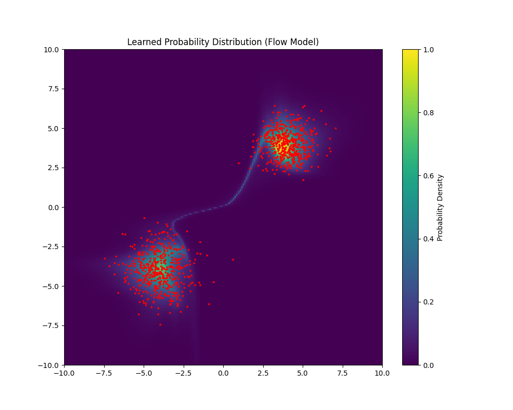

# normalizing-flows--pytorch

Implementation of NICE one of the first normalizing flow models. 



## Setup 
```
conda create -n nice-pytorch python=3.13
pip install torch matplotlib torchvision scikit-learn
``` 

## Implementation Details

Some seemingly small implementation details that are actually important. 
1. LeakyReLU in MLP. 
2. Make sure to alternate the masks in the coupling layers, so that there is expressiveness across all elements and not just half of them. 
3. The scaling layer is important so that the determinant doesn't get fixed at 1, and we can capture different levels of variation. 
4. Make sure the mask the outputs of the MLP. I didn't do this at first which caused headaches. 
5. Sampling from logistic distribution rather than Gaussian? 
6. Dequantization step in dataloaders? 

As a guide, the forward method is needed for likelihood calculation, while inverse method is needed for sample generation. Keep this in mind for other flow models. 

Original Repo: https://github.com/DakshIdnani/pytorch-nice (has a obvious and easily fixable bugs in it tho)
