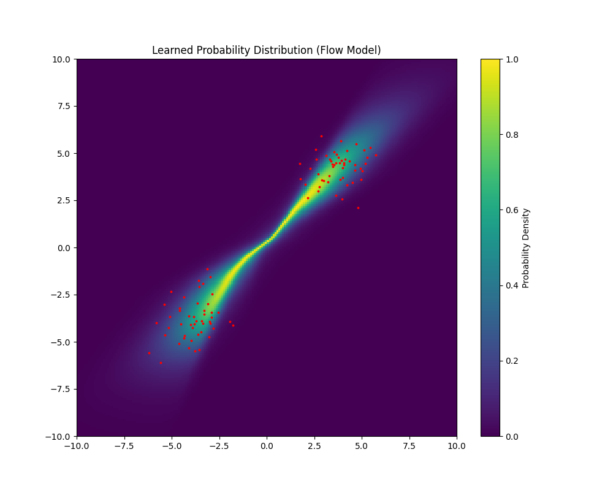
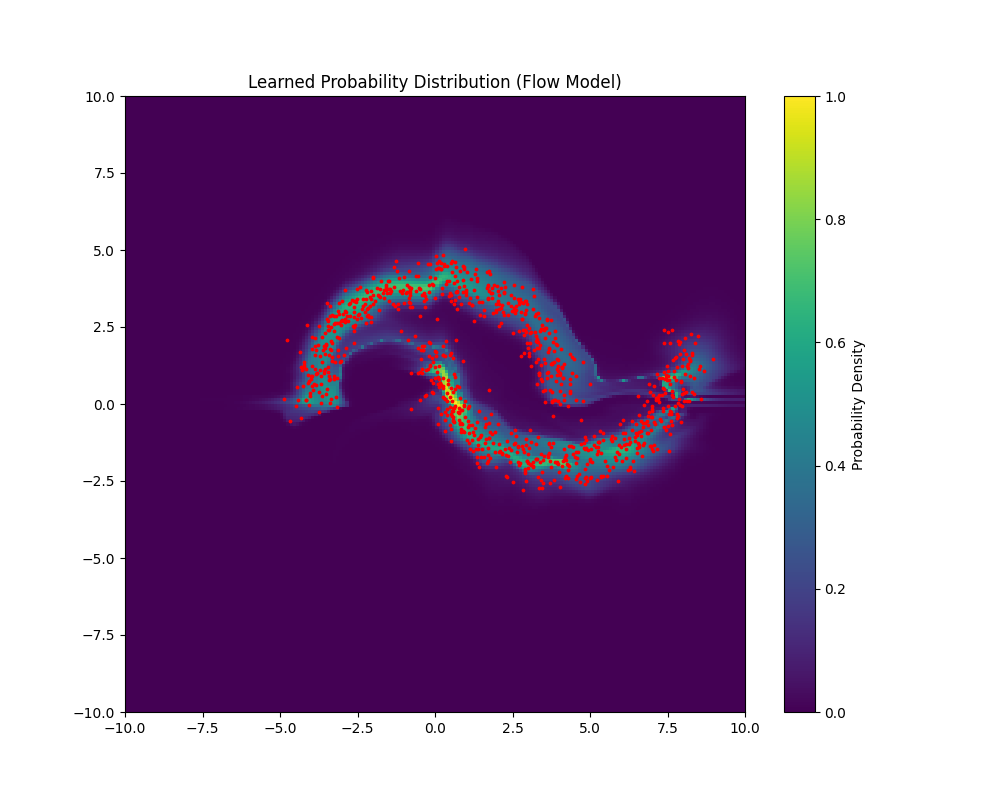
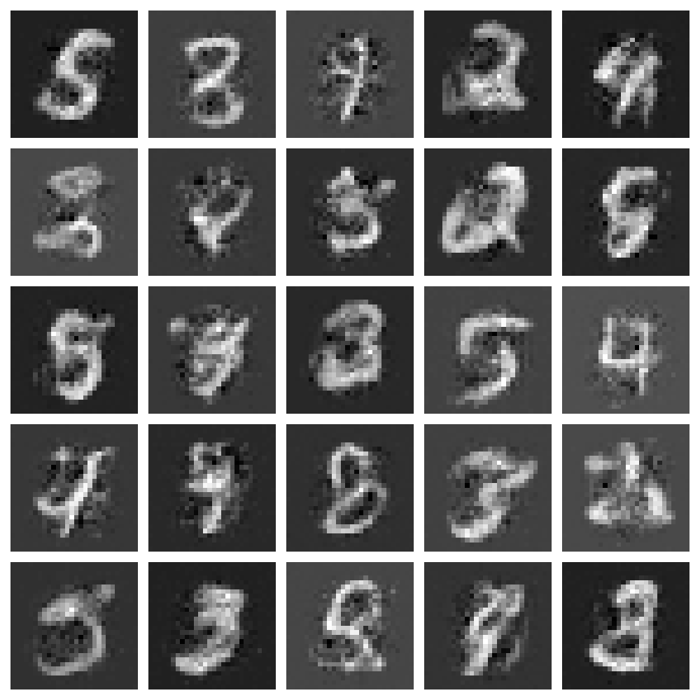
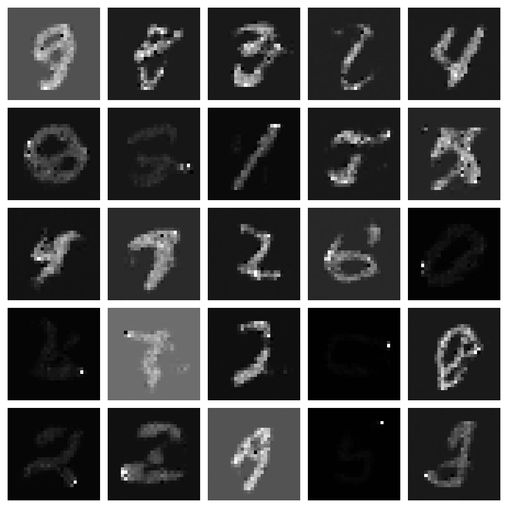
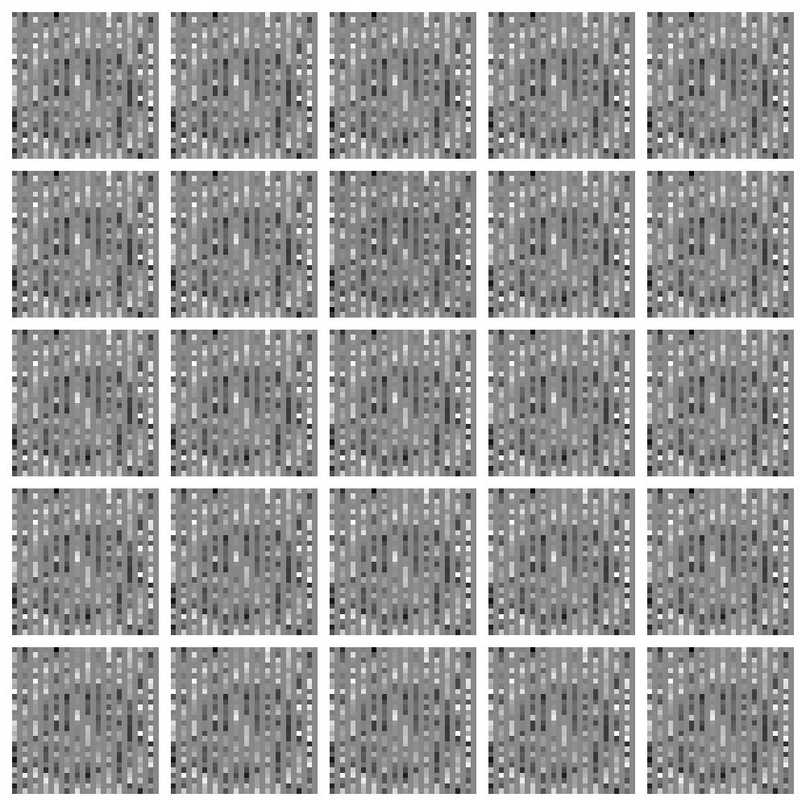

# normalizing-flows-pytorch

Implementation of normalizing flow models: NICE, RealNVP, Glow, cGlow.

| Figure 1 | Figure 2 |
|----------|----------|
|  |  | 
| NICE fit on two Gaussians | RealNVP fit on Moons |
|  |  |
| NICE sample generation for MNIST | RealNVP sample generation for MNIST |

Setup. 
```
conda create -n nice-pytorch python=3.13
pip install torch matplotlib torchvision scikit-learn tqdm
``` 

Original Repo: https://github.com/DakshIdnani/pytorch-nice (has a obvious and easily fixable bugs in it tho)

## Implementation Details

   Batchnorm outputting nan during eval? 

### LeakyReLU 

   Haven't verified whether this is actually important. Might be able to get away with just using ReLU. 

### Alternating Masks 

   Make sure to alternate the masks in the coupling layers, so that there is expressiveness across all elements and not just half of them. 

### Scaling Layer in NICE

   Without the scaling layer, the model training is absolutely trash since it is volume preserving. The loss barely goes down: 
   ```
   1117.9590643700133
   1100.347449509641
   1096.680653154089
   1094.952208693484
   1093.921014793883
   ```

### Masking 

   Make sure the mask the outputs of the MLP. I didn't do this at first which caused headaches. 

### Dequantization of Discrete Data 

   For MNIST and other image datasets where the values are quantized into 256 values in $[0, 1]$, it is essential that we [dequantize the data](https://stats.stackexchange.com/questions/409284/why-does-discrete-data-distribution-has-differential-entropy-of-negative-infinit). Without it, the model can "cheat" and cause log likelihood values to explode. 
   ```
   Epoch 0 completed. Log Likelihood: -1068.6265869140625
   ...
   Epoch 24 completed. Log Likelihood: 1765.023681640625
   Epoch 25 completed. Log Likelihood: 1810.0137939453125
   Epoch 26 completed. Log Likelihood: -8.325275106319899e+19
   Epoch 27 completed. Log Likelihood: -2.307039320814387e+16
   Epoch 28 completed. Log Likelihood: -1.3370482300551168e+16
   ```

   This causes the figures to look like this. 

   

### Gradients Shouldn't Exist in Latent Distribution  

   Make sure you don't put gradients on the Gaussian/Logistic distribution. 
   They sample from logistic distribution for MNIST, SVHN, CIFAR-10. A standard normal for TFD. 

